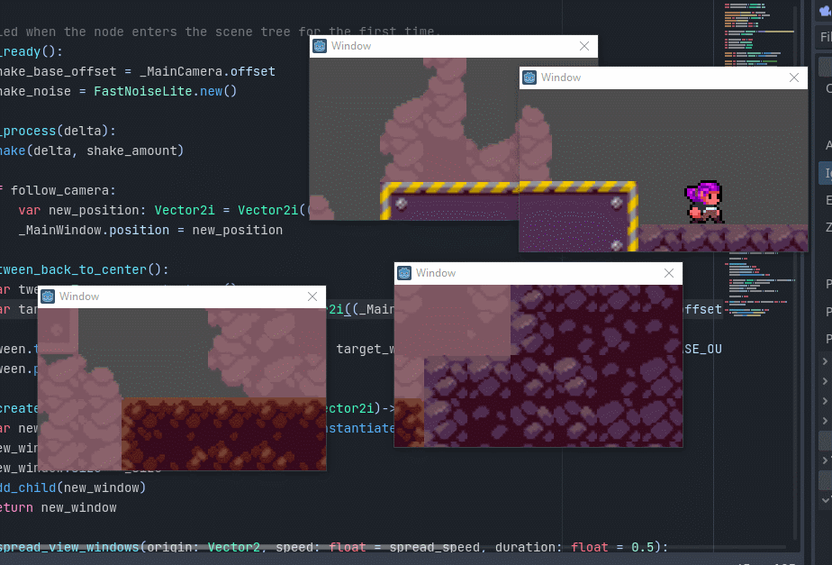

# Multiple Windows tutorial for Godot 4.3

- [Contents of this Repository](#contents-of-this-repository)
- [Introduction](#introduction)
- [Part 1 - Using Godot 4's Window](#part-1---using-godot-4s-window)
- [Part 2 - Making windows share the same world](#part-2---making-windows-share-the-same-world)
	- [Camera following a window's position](#camera-following-a-windows-position)
	- [Camera in a separate window](#camera-in-a-separate-window)
	- [Sharing the same world](#sharing-the-same-world)
- [Part 3 - Making a character that moves across windows](#part-3---making-a-character-that-moves-across-windows)
	- [Making the main window (almost) invisible](#making-the-main-window-almost-invisible)
	- [Hiding the world in the main window](#hiding-the-world-in-the-main-window)
	- [Moving the window with the character](#moving-the-window-with-the-character)
- [Limitations](#limitations)
- [Conclusions](#conclusion)

## Contents of this Repository

This project is a demo of how Godot 4's multiple windows feature allows for interesting 4th-wall-breaking mechanics. It was created with Godot 4.0 and updated to Godot 4.3 by [@wadantasjr](https://github.com/wadantasjr).

### Controls:
- **Arrows**: moves the character
- **Space**: when focused on the character, spawns another window
- **Escape**: when focused on the character, quits the demo

### Scenes:
- **demo** is the scene created by following the tutorial step-by-step. Scripts are integrated to the scene and are not perfect, but functional
- **main** is the default scene. Uses an improved version of the tutorial scripts
- **view_window** is a window with a camera already setup 
- **level** contains the actual level, with a tilemap and a few background layers
- **character** contains a working character controller without a camera

### Scripts:
- **Main.gd** contains the logic of the main window. Close to the tutorial with a few improvements
- **ViewWindow.gd** contains the logic of every additional window
- **Character.gd** is the character controller's script
- **MovementProvider.gd** has the base logic for sending inputs to the character controller
- **MovementProviderPlayer.gd** extends `MovementProvider` for player inputs

*This project uses sprites from my game **A Key(s) Path**, which is open-source on [GitHub](https://github.com/geegaz/A-Key-s-Path) and available on [Itch](https://geegaz.itch.io/out-of-controls).<br>
The project also uses Portponky's excellent plugin **Better Terrain** for Godot 4.3, check it out on [Github](https://github.com/Portponky/better-terrain) !*

---

## Introduction
So, a while ago I posted [a tweet about using multiple windows](https://twitter.com/geegaz_/status/1632419279843803138) with the Godot 4.0 release. Here's what it looked like:



So I'm making this tutorial since many of you seemed to enjoy it ! Here is the basic idea: 

> The character is a separate unresizeable, borderless and transparent window that's exactly the size of the character's sprite. Additional windows that are instanciated have their own camera, and copy the main window's world_2d to see the same world. The character manipulates the main window's position to seem like they're moving around on the screen, and the additional windows move their camera in the world to match the window's position on the screen.

The tutorial will be divided in 3 parts:
1. **How to use the new Window node**
2. **How to make multiple windows share the same world**
3. **How to make a character that can move outside windows**

Now with all that in mind, let's start !


## Part 1 - Using Godot 4's Window

Godot 4 introduces a new kind of node, **Window**, which replaces Godot 3's Popup node. This new node is much more powerful, as it can be either embeded in the main window as a regular Control but can also be an entirely separate window ! 

Window also inherits from Viewport, which means Windows are actually viewports and can use all the properties and methods from Viewport nodes. In fact, that's actually what we're going to use to display the same world in multiple windows.

Here is what the main parameters for the Window look like in the inspector.


If you've already tweaked the projects setting a lot in Godot, some of the flags might seem familiar. A lot of them are in common with the project's Window settings, along with some ones that only make sense for additional window. Of course, this is not the complete list of the Window's properties - you can find all of them [on the Godot wiki](https://docs.godotengine.org/en/stable/classes/class_window.html) !

Here are the flags we're going to use, and what they do:
- **transient**:     this window will close at the same time as its parent window, and can't enter fullscreen
- **unresizeable**:  this window can't be resized nor maximized
- **borderless**:    no border or title bar on this window
- **always_on_top**: this window stays on top of others even when focusing another one
- **transparent**:   *allows* this window to be transparent - other settings need to be set to make it actually transparent

But when you create a Window node and test your project, you might notice it appears by default as a Control node, embeded in the main window. 
To fix that, go in the **Project Settings** > **Window** > switch to **Advanced Settings** > disable **Embed Subwindows**


## Part 2 - Making windows share the same world

Now, let's do something fun with a window !

### Camera following a window's position

`Main.gd`
```gdscript
extends Node

@onready var _Camera: Camera2D = $Camera2D

func _process(delta: float) -> void:
	_Camera.position = get_window().position
```


Attach this script to a node in your scene, and add a Camera2D to this node. The camera will follow the window's position on the screen, although with a slight delay. This is due to the window's position updating before the `_process()` method is called in the engine, making the camera flicker and lag behind.

### Camera in a separate window

`ViewWindow.gd`
```gdscript
extends Window

@onready var _Camera: Camera2D = $Camera2D

var last_position: = Vector2i.ZERO
var velocity: = Vector2i.ZERO

func _ready() -> void:
	# Set the anchor mode to "Fixed top-left"
	# Easier to work with since it corresponds to the window coordinates
	_Camera.anchor_mode = Camera2D.ANCHOR_MODE_FIXED_TOP_LEFT
	
	transient = true # Make the window considered as a child of the main window
	close_requested.connect(queue_free) # Actually close the window when clicking the close button

func _process(delta: float) -> void:
	velocity = position - last_position
	last_position = position
	_Camera.position = get_camera_pos_from_window()

func get_camera_pos_from_window()->Vector2i:
	return position + velocity
```


Here, there's a little more going on: this time we're using a separate window, which means we can access its position directly. I also added the window's velocity from the last frame to the camera's position to mitigate the view lagging behind. There's still flickering, but the view follows more closely the actual position of the window.


### Sharing the same world

But now you might start to notice the issue with what we're trying to do. I put a sprite on the main node of the scene, but it doesn't appear in the additional window even when moving the window to the top-left of the screen where the sprite should be. Now that's the regular way windows would work - but not ours ! Our goal is to have the world the character is moving in shown simultaneously on several windows.

For this, we'll need an additional script on the main node, at the root of the scene:

`Main.gd`
```gdscript
extends Node

@onready var _MainWindow: Window = get_window()
@onready var _SubWindow: Window = $Window

func _ready():
  _SubWindow.world_2d = _MainWindow.world_2d
```


...And that's pretty much it !

Now when you move the subwindow to the top-left corner of your screen, you should see a part of the sprite ! At this point, I'd recommend you make the Window and Camera2D a separate scene, to be able to reuse it more easily or instanciate it at runtime.

And now, the most important (and longest) part:


## Part 3 - Making a character that moves across windows

Using the knowledge of the previous parts, you may have an idea now of how we're going to do this. Here, the character is actually the main window of the game !

For the character controller, I adapted the controller from A Key(s) Path to this project. It can move horizontally using the **left and right** keys, and jump at a variable height using the **up** key. If you're interested by the controller code, take a look at [`Character.gd`](scripts/Character.gd), [`MovementProvider.gd`](scripts/movement_providers/MovementProvider.gd) and [`MovementProviderPlayer.gd`](scripts/movement_providers/MovementProviderPlayer.gd), but we're only going to focus on manipulating the window.

### Making the main window (almost) invisible
Using the code from the previous parts, here is the code needed to make the main window almost invisible. This is the main trick to make the character seem like part of another window:

`Main.gd`
```gdscript
# declare the variables...

func _ready():
	# Enable per-pixel transparency, required for transparent windows but has a performance cost
	# Can also break on some systems
	ProjectSettings.set_setting("display/window/per_pixel_transparency/allowed", true)
	# Set the window settings - most of them can be set in the project settings
	_MainWindow.borderless = true		# Hide the edges of the window
	_MainWindow.unresizable = true		# Prevent resizing the window
	_MainWindow.always_on_top = true	# Force the window always be on top of the screen
	_MainWindow.gui_embed_subwindows = false # Make subwindows actual system windows <- VERY IMPORTANT
	_MainWindow.transparent = true		# Allow the window to be transparent
	# Settings that cannot be set in project settings
	_MainWindow.transparent_bg = true	# Make the window's background transparent
	
	# set the subwindow's world...

```

So, what is happening there? 

First, we activate **per-pixel transparency** in the project settings, which is the actual setting that allows windows to show the background of the desktop when they're transparent. 

Next, we set a bunch of flags to make the window **borderless, unresizeable and always on top**, which will make it completely unmoveable using the mouse. We also disable the window embeding subwindows, since we want other windows to display outside of it.

Finally, we **allow the window to be transparent** and set the **background of the window to be transparent**. While this might sound strange (setting a similar property twice ?), `transparent` is only a flag of the window to allow transparency while `transparent_bg` is inherited from Viewport and makes the background of the window output transparency instead of the usual clear color. Mixed with per-pixel transparency, this combination of 3 settings makes transparent windows possible !

*Most of these settings can (and should) be set in the Project Settings directly, when using Advanced Settings. But I set them here for the sake of flexibility and showing what the value of each of them should be !*

### Fitting the window to the character

Now, I'm going to assume you have a character controller on hand that you can use and an environment you can place it into.

After placing the camera as a child of the character, here a small snippet to set the main window's size to the size of the character, to avoid blocking the mouse on a large portion of the screen and drawing too much empty space:

`Main.gd`
```gdscript
# declare the variables...

@export var player_size: Vector2i = Vector2i(32, 32) # Should be the size of your character sprite, or slightly bigger

func _ready():
	# setup the main window...

	# The window's size may need to be smaller than the default minimum size
	# so we have to change the minimum size BEFORE setting the window's size
	_MainWindow.min_size = player_size
	_MainWindow.size = _MainWindow.min_size

	# set the subwindow's world...
```


### Hiding the world in the main window

While the window might be the right size you can still see the world behind the player, breaking the illusion. Using visibility layers, we can hide the world in the main window and hide the player in other windows.

First, set the player's sprite visibility layer to a different one than the world's


Then, we can add these lines to the `Main.gd`:

`Main.gd`
```gdscript
# declare the variables...

@export_range(0, 19) var player_visibility_layer: int = 1
@export_range(0, 19) var world_visibility_layer: int = 0

func _ready():
	# setup the main window...
	# fit the main window to the character...

	# To only see the character in the main window, we need to 
	# move its sprite on a separate visibility layer from the world
	# and set the main window to cull (not show) the world's visibility layer
	_MainWindow.set_canvas_cull_mask_bit(player_visibility_layer, true)
	_MainWindow.set_canvas_cull_mask_bit(world_visibility_layer, false)

	# Contrarily to the main window, hide the player and show the world
	_SubWindow.set_canvas_cull_mask_bit(player_visibility_layer, false)
	_SubWindow.set_canvas_cull_mask_bit(world_visibility_layer, true)

	# set the subwindow's world...
```

### Moving the window with the character

At this point, the only thing remaining is making our window move ! This is quite easy, although you have to take into account that the character's camera is usually using a `drag center` anchor which affects the calculations of the window's final position.

Here's the code for that (you'll just need to assign the main camera in the inspector):

`Main.gd`
```gdscript
# declare the variables...

@export_node_path("Camera2D") var main_camera: NodePath
@onready var _MainCamera: Camera2D = get_node(main_camera)

# all the previous code...

func _process(delta):
	# Update the main window's position
	_MainWindow.position = get_window_pos_from_camera()

func get_window_pos_from_camera()->Vector2i:
	return Vector2i(_MainCamera.global_position + _MainCamera.offset) - player_size / 2
```

Now you should have a character that moves around on your screen, and which position matches the world you see in the additional window. 

The only problem is that the character and the world might appear very small on the screen... to fix that, you might want to zoom your camera**s** and use that zoom as a multiplier in all the places that change the window or the camera position:

`Main.gd`
```gdscript
func _ready():
	# when setting the main window's size...
	_MainWindow.min_size = player_size * Vector2i(_MainCamera.zoom)
	_MainWindow.size = _MainWindow.min_size

# when calculating the new window position...
func get_window_pos_from_camera()->Vector2i:
	return (Vector2i(_MainCamera.global_position + _MainCamera.offset) - player_size / 2) * Vector2i(_MainCamera.zoom)
```
`ViewWindow.gd`
```gdscript
# when calculating the new camera position...
func get_camera_pos_from_window()->Vector2i:
	return (position + velocity) / Vector2i(_Camera.zoom)
```

And here it is !


## Limitations

While this prototype is fun, you might notice a few flaws very quickly:
- since windows are their own viewports, control nodes and CanvasLayers will not appear in other windows, which means for example that a ParallaxBackground would need to be added to every new window in order to be visible in them
- the view of the world in View Windows flickers when you move the window. This is due to the engine running the `_process()` method a frame later after the window was moved. While I did a basic fix to mitigate the view lagging behind, it had no effect on the flickering
- the more additional windows you open, the worse the performances. Every window is an additional viewport, so even if they cover a small surface of the screen their impact is still significant, especially with per-pixel transparency enabled. This might not be apparent with the current demo and on high-end PCs, but still needs to be taken into consideration
- more of a design flaw, but the character can walk even on the invisible terrain. Coding a system so that only the visible shapes have collisions would've been too much work for this proof-of-concept


## Conclusion

Congratulations for following to the end, this is how I made the gif you saw at the start !

Of course, there are ways to do it differently, maybe more efficiently or in a more stable way. There was an example from BrightShotGames on twitter that [made a similar thing on Unity](https://twitter.com/shot_bright/status/1633218766992490496) using a fullscreen transparent window. But currently, Godot is the only engine that supports multiple windows to this extent.

Anyway, hope you'll have fun with it !

[**- Geegaz**](https://geegaz.itch.io)
